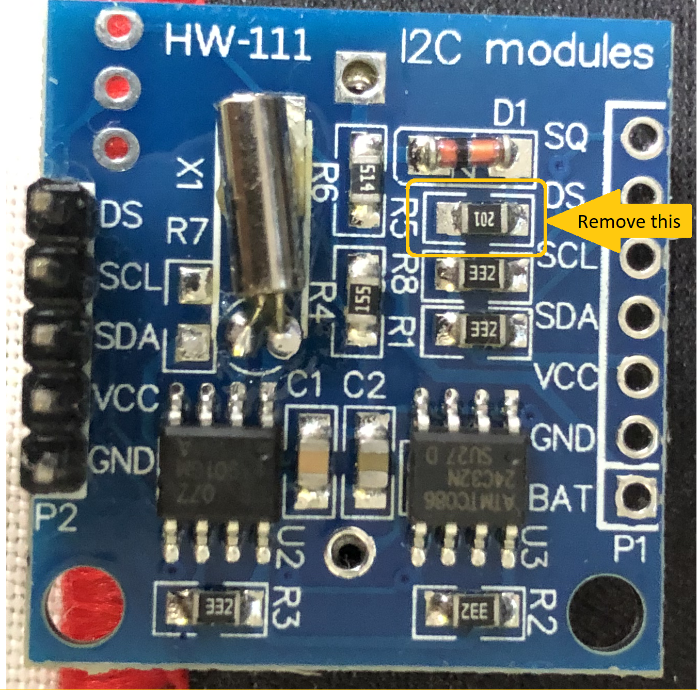

# LED Matrix clock

![Picture of the Project][capture-img-v07]

## BOM

* Arduino Uno
* [8x32 LED Matrix module with MAX7219 board][amz-led]

## Pin Connections

|Arduino Pin| LED Board Pin|
|-----------|--------------|
| +5V       |    VCC       |
| GND       |    GND       |
| Pin 10    |    CLK       |
| Pin  9    |    CS        |
| Pin  8    |    DIN       |

![Connection Diagram][MAX7219]

## Releases

### v0.1

  First iteration with simple delay in loop function to measure time.

  Simple test shown about 3 hours delay per 24 hours cycle. 

### v0.2

  Second iteration. Instead of using delay in loop function, use Hardware timer interrupt to count time
  and increase conters. Espected to be more precise than v0.1.
  
### v0.7

  Connecting RTC DS1307 module to arduino.

  |Arduino Pin|RTC DS1307 Pin|
  |-----------|--------------|
  | +5V       | VCC          |
  | GND       | GND          |
  | A4        | SDA          |
  | A5        | SCL          |

  ![Connection Diagram][DS1307]

#### Disable charging circuit from DS1307

  To avoid damaging the cell battery, disable the charging circuit from DS1307 module. To disable the chaarger circuit
  remove the R5 resistor as shown in the picture.

  [][DS1307_charger]

----
[capture-img-v07]: images/capture.jpg "Capture"
[amz-led]: https://www.amazon.com/MAX7219-Control-Display-Max7219-Controller/dp/B07GWV2GD7
[MAX7219]: images/max7219_led_matrix_32x8.png "LED_MATRIX_32x8"
[DS1307]: images/arduino_rtc_ds1307.jpg "Realtime Clock"
[DS1307_charger]: images/DS1307_Disable_charger.png "Disable DS1307 charger"